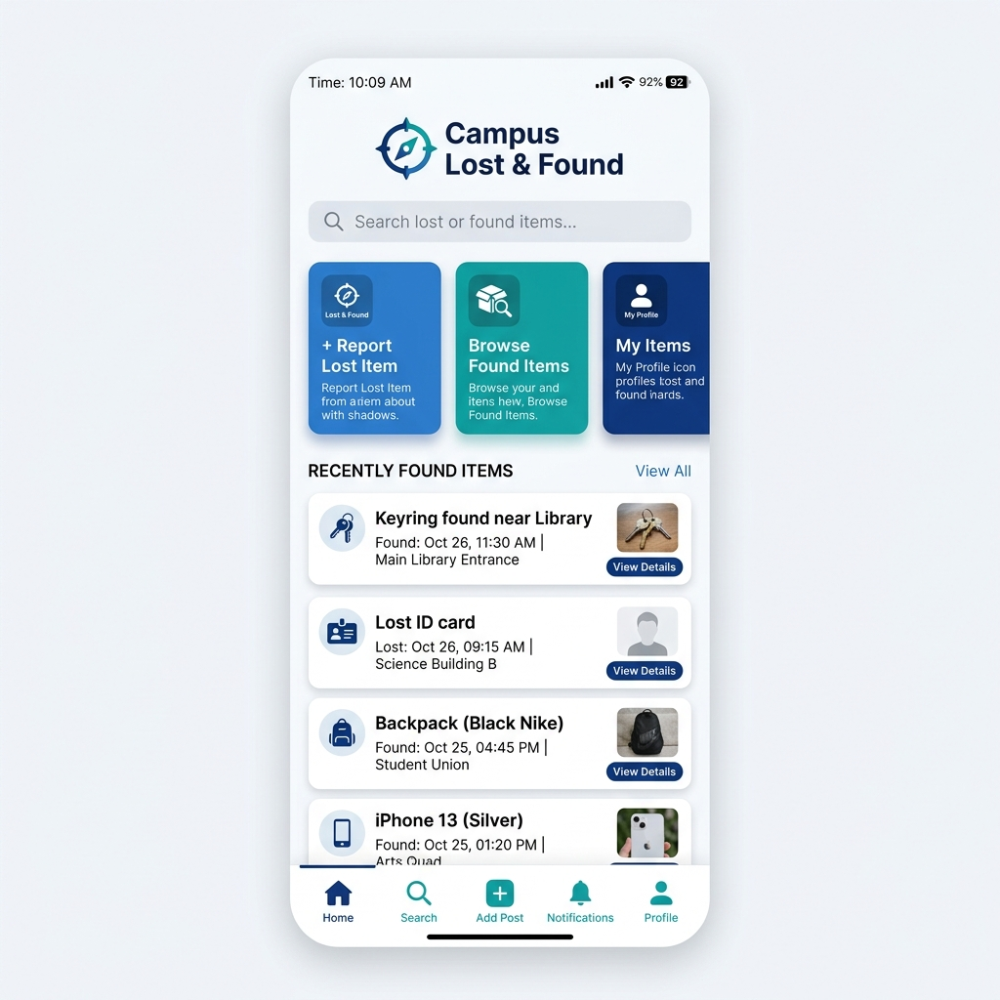
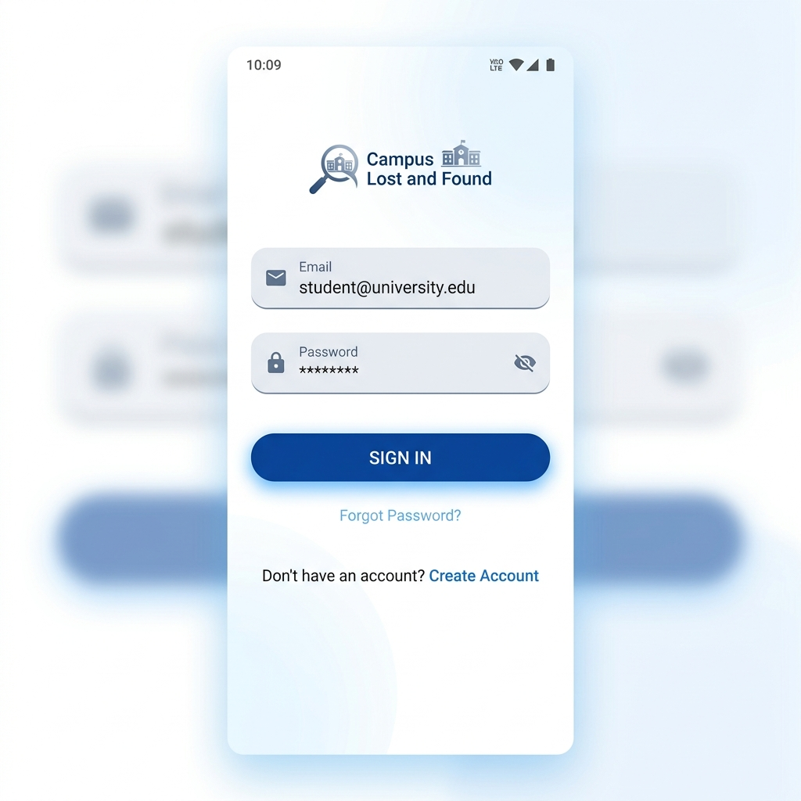
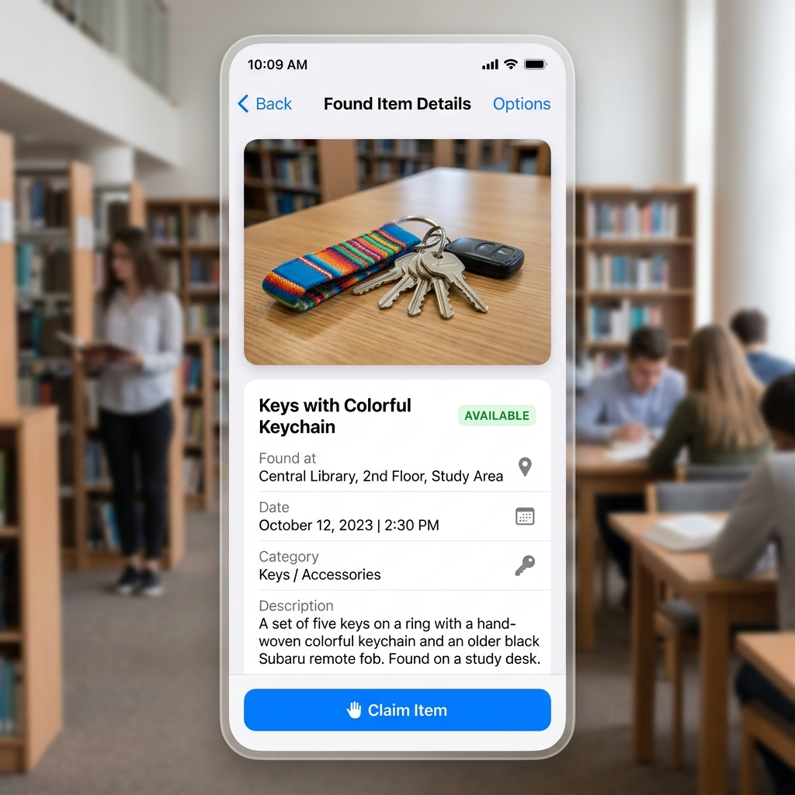
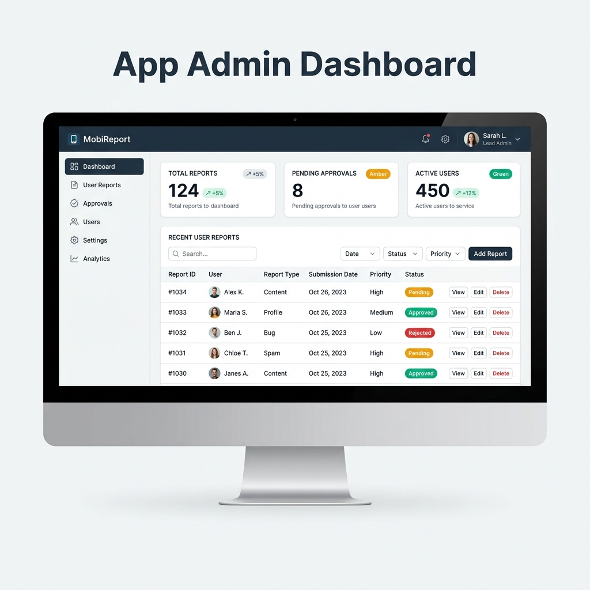

# 🏫 Campus Lost and Found Portal

<p align="center">
  
</p>

<p align="center">
  <a href="https://developer.android.com/"></a>
  <a href="https://www.java.com/"></a>
  <a href="https://supabase.com/"></a>
  <a href="LICENSE"></a>
  
</p>

---

### 🌟 Project Vision
Losing a personal item on a large campus can be stressful. The **Campus Lost and Found Portal** is a sophisticated, digital solution designed to connect finders and owners instantly. Built with a focus on security, ease of use, and real-time communication, this app replaces traditional, inefficient physical notice boards with a modernized mobile experience.

---

## 📸 Interface Showcase

<table align="center">
  <tr>
    <td align="center"><b>Secure Entry</b></td>
    <td align="center"><b>Item Discovery</b></td>
    <td align="center"><b>Admin Control</b></td>
  </tr>
  <tr>
    <td></td>
    <td></td>
    <td></td>
  </tr>
  <tr>
    <td align="center">Modern Authentication</td>
    <td align="center">Detailed Item Insights</td>
    <td align="center">Powerful Management</td>
  </tr>
</table>

---

## 🚀 Key Features

### 👤 For Students & Staff
- **Instant Reporting**: File a lost or found report in seconds with precise location data.
- **Visual Verification**: Upload and zoom in on high-resolution images to verify items.
- **Smart Tracking**: Monitor the status of your reported items (Pending, Approved, Returned).
- **Personalized Alerts**: Receive push-style notifications for matches and claim approvals.
- **Secure Profiles**: Manage your contact information and viewing preferences securely.

### 🛡️ For Campus Administrators
- **Robust Moderation**: Review all incoming reports to filter out spam or duplicates.
- **Role-Based Access**: Multi-tier admin levels with secure approval workflows.
- **User Management**: Monitor campus activity and manage user permissions.
- **Data Privacy**: Powered by PostgreSQL Row-Level Security (RLS) to ensure data is only visible to authorized parties.

---

## 🛠️ Modern Tech Stack

| Component | Technology | Purpose |
| :--- | :--- | :--- |
| **Frontend** | Java (Native Android) | High-performance, native user experience. |
| **Backend** | Supabase | Real-time database, Auth, and Storage. |
| **Database** | PostgreSQL | Robust relational data with advanced triggers/functions. |
| **Image Loading** | Glide | Seamless image caching and smooth scrolling. |
| **Animations** | Lottie | Engaging, professional micro-interactions. |
| **Networking** | OkHttp & Gson | Reliable and efficient API communication. |

---

## 🏗️ Technical Highlights

- **Security First**: Implemented complex PostgreSQL policies (RLS) so users can only edit their own reports.
- **Performance**: Optimized list rendering with RecyclerView and smart image caching to handle large volumes of items.
- **Reliability**: Custom error handling and offline-ready state management using modern Android practices.

---

## 📦 Getting Started

### Prerequisites
- **Android Studio** (Ladybug or newer)
- **Supabase Account** (to host your backend)
- **JDK 17**

### Installation
1. **Clone the Repo**
   ```bash
   git clone https://github.com/ArfinSarker/Campus-Lost-and-Found-Portal.git
   ```
2. **Environment Configuration**
   Add your keys to `local.properties`:
   ```properties
   SUPABASE_URL=your_project_url
   SUPABASE_KEY=your_anon_key
   ```
3. **Database Setup**
   Run the scripts in the `/supabase` folder inside your Supabase SQL editor to initialize the schema.

---

## 🤝 Contributing
Contributions make the campus community stronger! If you have suggestions or want to add a feature, please:
1. Fork the Project
2. Create your Feature Branch (`git checkout -b feature/AmazingFeature`)
3. Commit your Changes (`git commit -m 'Add some AmazingFeature'`)
4. Push to the Branch (`git push origin feature/AmazingFeature`)
5. Open a Pull Request

---

## 📜 License
Distributed under the MIT License. See `LICENSE` for more information.

<p align="center">
  <i>Developed with ❤️ by Arfin Sarker</i>
</p>
